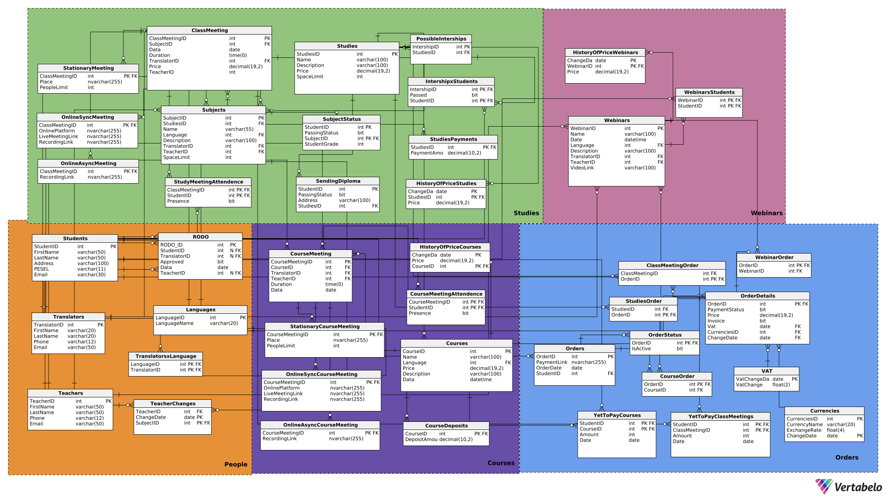

This project was created for the Introduction to the Databases course at AGH WI in the 2024/2025 academic year.

# Description

The application is a database system designed for a company offering various courses and training programs. Initially, services were provided only in-person, but due to the COVID-19 pandemic, they have been partially digitized. Currently, the service model is hybrid but varies significantly depending on the type of service.

# Technologies

+ MS SQL Server

# Schema

# System Features

## User Roles and Permissions

Users must create an account to access paid content.

Admins can manage content, delete webinars, and handle payments.

## Webinars

Live events hosted on cloud platforms.

Recorded and available for 30 days.

Can be free or paid (payment required for access).

No storage of binary data within the system.

## Courses

Short-term training programs.

Require completion of at least 80% of modules.

Modules can be:

In-person (attendance-based completion).

Online synchronous (live sessions, attendance required).

Online asynchronous (completion by watching recorded videos).

Hybrid (combination of online and in-person sessions).

## Study Programs

Long-term educational programs.

Require internship completion twice a year.

End with a final exam.

Syllabus must be predefined and cannot be modified.

Attendance required for at least 80% of sessions.
 
Possibility to enroll in individual sessions without joining the entire program.

## Payment Integration

Handled by an external payment system.

Users add products to a cart and receive a payment link.

Payment confirmation updates access permissions.

Courses require a deposit upon registration, with full payment due 3 days before start.

Study programs require an enrollment fee and session payments at least 3 days in advance.

## Reporting

Financial reports on revenue per service.

List of debtors who have accessed services but not paid.

Enrollment statistics for upcoming events.

Attendance reports for completed events.

Presence lists with date, name, and attendance status.

Conflict report for users enrolled in overlapping courses.

## Database Requirements

Define database schema with integrity constraints.

Implement views for user-friendly data access.

Create stored procedures, triggers, and functions for data manipulation.

Implement indexes to optimize performance.

Define roles and permissions for different users.

Ensure compliance with business logic and constraints.

## Implementation

The system is implemented using MS SQL Server. The project includes database design, data generation, views, stored procedures, triggers, indexes, and user access controls.

